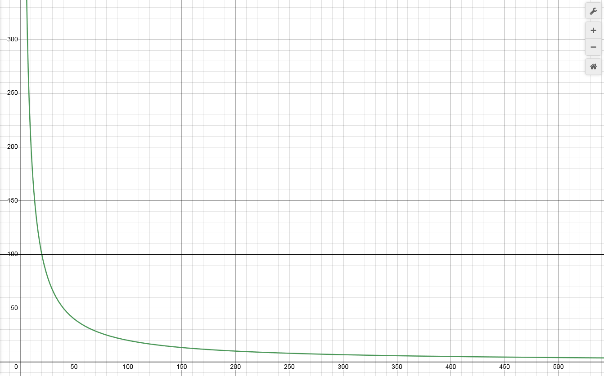

# 🏃‍ RVC training

## 🥼 General guidelines

### 🧬 Train for about 300 computer minutes (AKA minutes of audio on disk)
#### ➗ To calculate: you would need (300/training audio duration) epochs
* If you have 20 minutes of training audio, 15 epochs will usually be enough.
* if you have 10 minutes of training audio, 30 epochs will usually be enough.

If you still don't understand, refer to this graph. Click the graph to try for yourself:

**Green**: Epochs required (y) per x minutes of audio

$f(x)=ceil(\frac{300}{x})$

**Black**: Epochs required (y) per tminutes minutes of audio

$f(x)=ceil(\frac{300}{t_{minutes}})$